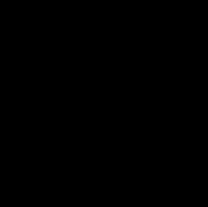

#   Лабораторная работы №3 по дисциплине "Системы копьютерного зрения"
# Трекинг мыши на видео с использованием методов компьютерного зрения

### Цель работы
&ensp; Разработать алгоритм для автоматического выделения и трекинга мыши на видео, используя классические методы компьютерного зрения. Программа реализована в Google Colab и включает этапы вычитания фона, обработки кадров, трекинга объекта и визуализации результатов.  

### Задания:
1. **Вычитание фона** — выделение мыши через медианное усреднение кадров и морфологию.  
2. **Трекинг** — отслеживание объекта методом корреляции шаблонов с адаптацией.  
3. **Обработка кадров** — бинаризация, морфология, фильтрация контуров по площади/пропорциям.  
4. **Визуализация** — отрисовка bounding box, центра и траектории в GIF.  
5. **Пакетная обработка** — автоматическая обработка 10 видео с выводом статистики.  

---

**2 из 10 видео для обработки**
 

### Описание работы программы для трекинга мыши на видео  

#### Инициализация и настройка окружения  
&ensp; Программа начинается с подключения необходимых библиотек. Для обработки видео и реализации методов компьютерного зрения используется **OpenCV** (`cv2`), а для работы с массивами данных — **NumPy**. Создание анимированных результатов в формате GIF обеспечивается библиотекой **imageio**. Для доступа к данным, хранящимся в Google Drive, задействуются инструменты **Google Colab Tools**. Пути к исходным видео и выходным файлам задаются через переменные `base_video_path`, `base_output_gif` и `base_mask_gif`, что позволяет автоматизировать обработку нескольких файлов по шаблону.  

#### Инициализация видеопотока  
&ensp; Видеопоток инициализируется функцией `initialize_video`, которая принимает путь к файлу и проверяет его доступность. В случае успешного открытия возвращаются объект захвата видео (`cv2.VideoCapture`) и исходные размеры кадра (`original_width`, `original_height`). Эти параметры критически важны для корректного масштабирования результатов и сохранения пропорций при визуализации.  

#### Создание модели статического фона  
&ensp; Модель фона вычисляется функцией `calculate_static_background`, которая анализирует первые `initial_frames` кадров. Каждый кадр преобразуется в градации серого (`cv2.cvtColor`) и подвергается медианному размытию (`cv2.medianBlur` с ядром 7x7) для подавления шумов. Медианное усреднение (`np.median`) всех обработанных кадров формирует устойчивую модель фона. Дополнительные морфологические операции (`cv2.morphologyEx` с эллиптическим ядром 5x5 и 3 итерациями) устраняют оставшиеся артефакты, такие как мелкие пятна или неровности.  

#### Обработка кадров и выделение объекта  
&ensp; Основная обработка реализуется в функции `process_frame`. На первом этапе выполняется **вычитание фона** — вычисляется абсолютная разница (`cv2.absdiff`) между текущим кадром и моделью фона, что позволяет выделить движущиеся объекты. Результат бинаризуется (`cv2.threshold` с порогом `var_threshold=10`), формируя маску движущихся областей. Параллельно создается дополнительная маска `bw_mask`, фильтрующая пиксели по яркости (порог 60), чтобы исключить переосвещенные участки. Комбинация масок (`cv2.bitwise_and`) усиливает точность выделения объекта.  

&ensp; Далее применяются морфологические операции: эрозия (`cv2.erode`) и дилатация (`cv2.dilate`) с ядром 9x9, которые удаляют шум и объединяют фрагменты объекта. Контурный анализ (`cv2.findContours`) выделяет объекты, фильтруя их по площади (`min_area=3000`) и соотношению сторон (`max_aspect_ratio=4.0`), чтобы исключить ложные срабатывания (например, тени или блики).  

#### Трекинг объекта  
&ensp; Трекинг реализован в функции `csrt_tracking`, которая использует корреляцию шаблонов для отслеживания объекта. При первом обнаружении сохраняется шаблон области интереса (ROI), преобразованный в градации серого и сглаженный Гауссовым фильтром. В последующих кадрах метод `cv2.matchTemplate` ищет совпадения с шаблоном, а порог `max_val < 0.5` определяет потерю трека. Шаблон обновляется каждые 5 кадров для адаптации к изменениям объекта (например, поворотам или изменению освещения). Координаты центра объекта (`cx`, `cy`) сглаживаются с помощью усреднения последних `MAX_SMOOTH_POINTS=3` точек с коэффициентом `SMOOTHING_FACTOR=0.3`, что устраняет дрожание траектории.  

#### Визуализация и сохранение результатов  
&ensp; Траектория движения объекта визуализируется функцией `draw_trajectory`, которая рисует ломаную линию (`cv2.polylines`) на каждом кадре. Результаты сохраняются в два GIF-файла:  
- **Основной GIF** (`output_gif`) содержит исходные кадры с нарисованными bounding box, центром объекта и траекторией.  
- **Маски объекта** (`mask_gif_path`) демонстрируют бинарные маски, выделяющие мышь.  
Масштабирование до 50% исходного разрешения (`scale_factor=0.5`) ускоряет обработку и улучшает читаемость результатов.  Пропуск кадров (`frame_skip=2`) используется для оптимизации размера GIF.  

#### Пакетная обработка  
&ensp; Программа обрабатывает 10 видеофайлов по шаблону `LB3_Mouse{i}.mp4` в цикле `for i in range(1, 11)`. Для каждого файла выводится статистика: исходная частота кадров (FPS), количество обработанных кадров и масок. Ошибки обрабатываются через блок `try-except`, что обеспечивает продолжение работы при сбоях.  

#### Ключевые параметры основной функции и их роль  

| Параметр               | Значение | Описание                                                                 |
|------------------------|----------|--------------------------------------------------------------------------|
| `var_threshold=10`     | 10       | Чувствительность вычитания фона. Меньшие значения увеличивают детализацию, но могут привести к шуму.     |
| `detection_interval=8` | 8        | Интервал кадров между полными циклами обнаружения объекта. Балансирует между скоростью и точностью.   |
| `min_area=10000`       | 10000    | Минимальная площадь объекта. Фильтрует шум и мелкие артефакты.   |
| `max_aspect_ratio=4.0` | 4.0      | Максимальное соотношение сторон. Исключает продолговатые объекты, такие как тени. |
| `frame_skip=2`         | 2        | Пропуск кадров для уменьшения размера и ускорения GIF анимации.  |

## Демонстрация работы

&ensp; Работу алгоритма можно видеть на следующих GIF-анимациях. На первой показана обработка 4 видео, на втором - 8. Оба ускорены в два раза посрдством удаления каждого второго кадра в видеопотоке. В каждом видео детектор находит видимый центр вижущегося объекта, после чего постепенно рисует траекторию на самом видео в зависимости от найденных конторов объекта и его движения

&ensp; На четвертом видео можно увидеть искажение траектории движеня мыши после того как сама мышь уходит из кадра. это связанно с тем что детектор, который определяет самый большой объект на видео случайно видит в *"шуме"* на видео движущийся объект, из-за чего детектор почти мгновенно перепрыгивает на него. На восьмом видео, детектор корректно пропадает после потери мыши

&ensp; Также при просмотре заметно что на левой анимации с бинаризированной маской обрезаны кадры, на которых мышка отсутсвует, и из-за чего видеокороче и проигрывается чаще. Это связанно с оптимизацией GIF формата сохранения файла, который объединяет одинаковые кадры в один, из-за чего кадры с полностью черным фоном пропускаются, оставляя один в последовательности одинаковых кадров.

 

 

&ensp; Остальные обработанные видео и их маску можно просмотреть в папках `Result_tracking_videos` и `Result_mask_videos` соответственно.

## Заключение 

&ensp; Программа демонстрирует полный цикл обработки видео: от захвата и анализа до визуализации, используя классические методы компьютерного зрения (вычитание фона, морфология, корреляция шаблонов). Подход не требует глубокого обучения и оптимизирован для работы в облачных средах, таких как Google Colab.
